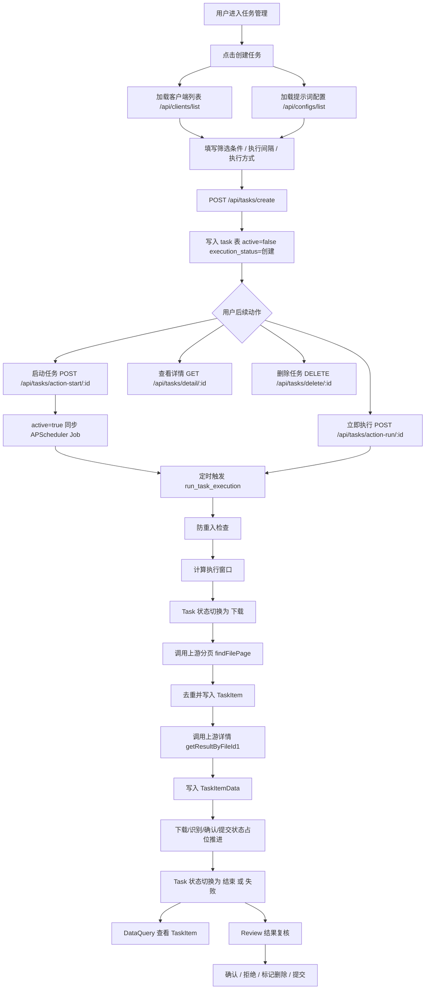
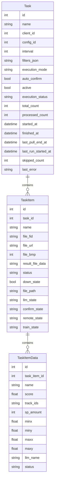

# 任务创建到执行全流程说明

> 生成日期：2026-04-28  
> 范围：基于当前代码与已有设计文档，只读整理 `Task / TaskItem / TaskItemData` 从创建、启停、执行、查看到复核的完整流转。  
> 说明：本文档描述**当前已经实现的真实代码流程**，并单独标注与 `docs/任务执行方案.md` 设计蓝图的差异。

---

## 1. 总览

当前任务体系以三层数据结构为主线：

- **Task**：任务定义与执行状态，保存客户端、提示词配置、筛选条件、调度间隔和执行进度。
- **TaskItem**：一次任务从上游拉取到的文件记录，按图片或视频保存处理状态。
- **TaskItemData**：单个文件的识别明细，保存原始识别结果、LLM 名称与复核状态。

用户使用主路径如下：

1. 先创建或确认已有 **客户端** 与 **提示词配置**。
2. 在前端 **任务管理** 页面点击 **创建任务**。
3. 填写筛选条件、执行间隔、执行方式后提交。
4. 任务写入数据库，默认 `active=false`、`execution_status=创建`。
5. 用户可选择 **启动调度**、**立即执行**、**查看详情** 或 **删除任务**。
6. 执行任务时，后端调用真实上游分页和详情接口，生成 `TaskItem` 与 `TaskItemData`。
7. 执行结束后，用户在任务详情页查看 TaskItem，或进入结果复核页进行确认、删除差异等动作。

---

## 2. 整体流程图



---

## 3. 数据模型关系



### 3.1 Task

`Task` 保存任务主信息。当前关键字段包括：

| 字段 | 含义 |
|---|---|
| `name` | 任务名称 |
| `client_id` | 关联客户端 |
| `config_id` | 关联提示词配置 |
| `interval` | 调度间隔，单位小时 |
| `filters_json` | 前端筛选条件序列化后的 JSON 字符串 |
| `execution_mode` | 执行方式，前端传 `auto` 或 `manual` |
| `auto_confirm` | 是否自动确认 |
| `active` | 是否启用自动调度 |
| `execution_status` | 任务执行状态 |
| `total_count` | 当前任务累计 TaskItem 数量 |
| `processed_count` | 已处理 TaskItem 数量 |
| `last_pull_end_at` | 自动任务滚动窗口游标 |
| `last_run_started_at` | 上一次执行发起时间 |
| `skipped_count` | 因重复或重入跳过的次数 |
| `last_error` | 最近一次失败原因 |

### 3.2 TaskItem

`TaskItem` 是任务拉取到的文件记录。它与上游业务文件通过 `file_fid` 绑定。

当前有数据库唯一约束：

```text
(task_id, file_fid)
```

这意味着同一个任务下，同一个上游文件只会落库一次。重复触发不会覆盖已有 TaskItem，以避免覆盖人工复核结果。

### 3.3 TaskItemData

`TaskItemData` 是单个文件的识别结果明细。当前状态值包括：

| 状态 | 含义 |
|---|---|
| `默认` | 原始识别结果，尚未标记变更 |
| `新增` | 设计预留，表示 LLM 新增结果 |
| `修改` | 设计预留，表示 LLM 修正原结果 |
| `删除` | 复核层标记删除，不物理删除行 |

---

## 4. 前置资源准备

创建任务前必须存在两个资源：

1. **客户端 Client**
2. **提示词配置 Config**

前端创建任务页会在初始化时并发请求：

```http
GET /api/clients/list
GET /api/configs/list
```

如果客户端列表为空，页面提示：`请先创建客户端。`  
如果提示词配置为空，页面提示：`请先创建提示词配置。`

### 4.1 创建客户端接口

```http
POST /api/clients/create
```

示例请求：

```json
{
  "name": "任务项目",
  "apiUrl": "https://example.com",
  "account": "task-admin",
  "password": "secret-123",
  "status": "启用"
}
```

### 4.2 创建提示词配置接口

```http
POST /api/configs/create
```

示例请求：

```json
{
  "name": "任务提示词",
  "remark": "任务测试用提示词",
  "text": "请返回识别结果。",
  "format": 0
}
```

---

## 5. 前端创建任务流程

### 5.1 入口

用户从左侧导航点击 **任务管理**，应用渲染 `Tasks` 页面。

在任务管理页点击 **创建任务** 后，前端切换到 `CreateTask` 页面。

### 5.2 创建页初始化

`CreateTask` 页面执行以下初始化逻辑：

1. 请求客户端列表。
2. 请求提示词配置列表。
3. 默认选择第一条客户端和第一条提示词配置。
4. 如果缺少任一基础资源，则显示错误提示。

### 5.3 用户填写内容

创建页当前包含 5 个配置区：

1. **选择客户端**：对应 `client_id`。
2. **选择提示词配置**：对应 `config_id`。
3. **选择执行间隔时间**：对应 `interval_hours`。
4. **筛选条件**：转换为 `filters`。
5. **选择自动执行还是手动执行**：对应 `execution_mode`。

### 5.4 执行间隔

前端支持的执行间隔如下：

| 文案 | 值 |
|---|---:|
| 每小时 | `1` |
| 每 6 小时 | `6` |
| 每 12 小时 | `12` |
| 每天 | `24` |
| 每周 | `168` |

后端也校验 `interval_hours` 必须是上述值之一。

### 5.5 筛选条件

前端表单字段与后端字段映射如下：

| 前端字段 | 后端字段 | 说明 |
|---|---|---|
| `classifyList` | `classify_list` | 识别分类 |
| `keyword` | `keyword` | 关键词 |
| `spName` | `sp_name` | 物种名称 |
| `startTime` | `start_at` | 开始时间 |
| `endTime` | `end_at` | 结束时间 |
| `fileBmp` | `media_types` | 图片或视频 |
| `uploadType` | `upload_types` | 上传类型 |
| `idType` | `identify_source` | 识别来源 |

媒体类型转换规则：

| 前端值 | 后端值 |
|---|---|
| `image` | `media_types: ["image"]` |
| `video` | `media_types: ["video"]` |
| `all` | `media_types: []` |

当前前端虽然在选项中保留 `audio`，但后端 Task Schema 只允许 `image` 或 `video`。

### 5.6 提交创建

点击 **确认创建任务** 后，前端调用：

```http
POST /api/tasks/create
```

示例请求：

```json
{
  "name": "项目-手动任务-20260428-153000",
  "client_id": 1,
  "config_id": 1,
  "interval_hours": 1,
  "execution_mode": "manual",
  "auto_confirm": false,
  "filters": {
    "classify_list": [1, 2],
    "keyword": "鸟类",
    "sp_name": "白鹭",
    "start_at": "2026-04-20",
    "end_at": "2026-04-25",
    "media_types": ["image"],
    "upload_types": [],
    "identify_source": []
  }
}
```

当前前端固定提交：

```json
"auto_confirm": false
```

因此普通页面创建的任务默认需要人工复核，不会自动确认。

---

## 6. 后端创建任务流程

### 6.1 路由入口

```http
POST /api/tasks/create
```

对应代码：

- `aiSelfTest/aiSelfTest/api/task.py:create_task_route`
- `aiSelfTest/aiSelfTest/services/task.py:create_task`

### 6.2 请求模型

后端使用 `TaskCreateRequest` 校验请求体。

关键规则：

| 字段 | 校验 |
|---|---|
| `name` | 必填，1 到 200 字符 |
| `client_id` | 必须大于 0 |
| `config_id` | 必须大于 0 |
| `interval_hours` | 必须为 `1/6/12/24/168` |
| `execution_mode` | 必须为 `auto` 或 `manual` |
| `filters` | 必须符合 `TaskFiltersPayload` |

### 6.3 入库行为

服务层会创建 `Task`：

```python
Task(
    name=payload.name,
    client_id=payload.client_id,
    config_id=payload.config_id,
    interval=payload.interval_hours,
    filters_json=_serialize_filters(payload.filters),
    execution_mode=payload.execution_mode,
    auto_confirm=payload.auto_confirm,
    active=False,
)
```

创建完成后默认状态：

| 字段 | 值 |
|---|---|
| `active` | `False` |
| `execution_status` | `创建` |
| `total_count` | `0` |
| `processed_count` | `0` |
| `last_error` | `None` |

---

## 7. 任务管理页流程

### 7.1 任务列表刷新

任务管理页每 2 秒请求一次：

```http
GET /api/tasks/list
```

后端返回统一响应：

```json
{
  "code": 0,
  "message": "success",
  "data": {
    "items": []
  }
}
```

前端 `fetchApi` 会自动剥离外层包装，只把 `data` 返回给业务组件。

### 7.2 任务卡片展示

任务卡片展示：

- 任务名称。
- 项目 ID。
- 执行间隔。
- 执行方式。
- 当前执行状态。
- 处理进度。
- 失败错误信息。

状态文案映射：

| 后端状态 | 前端显示 |
|---|---|
| `创建` | 未开始 |
| `下载` | 下载中 |
| `模型识别` | 识别中 |
| `核查` | 待核查 |
| `提交` | 提交中 |
| `结束` | 已完成 |
| `失败` | 执行失败 |

### 7.3 可执行动作

任务卡片支持以下动作：

| 前端动作 | 接口 | 说明 |
|---|---|---|
| 查看任务详情 | `GET /api/tasks/detail/:id` | 进入 TaskItem 工作区 |
| 启动 | `POST /api/tasks/action-start/:id` | 启用自动调度 |
| 暂停/停止 | `POST /api/tasks/action-stop/{id}` | 停用自动调度 |
| 立即执行 | `POST /api/tasks/action-run/:id` | 立刻执行一次任务 |
| 结果复核 | 前端进入 Review | 仅已完成任务显示 |
| 删除任务 | `DELETE /api/tasks/delete/:id` | 删除任务及关联数据 |

---

## 8. 启动、停止、立即执行

### 8.1 启动任务

接口：

```http
POST /api/tasks/action-start/{task_id}
```

后端行为：

1. 读取 Task。
2. 设置 `active=True`。
3. 更新 `updated_at`。
4. 提交数据库。
5. 调用 `_sync_scheduler(task.id)` 同步调度器。
6. 返回 `id / active / execution_status`。

注意：启动任务**不会立即执行**，它只是将任务加入 APScheduler 自动调度。

### 8.2 停止任务

接口：

```http
POST /api/tasks/action-stop/{task_id}
```

后端行为：

1. 读取 Task。
2. 设置 `active=False`。
3. 更新 `updated_at`。
4. 提交数据库。
5. 同步调度器，移除对应 Job。
6. 返回 `id / active / execution_status`。

### 8.3 立即执行任务

接口：

```http
POST /api/tasks/action-run/{task_id}
```

后端行为：

1. 进入 `run_task_once`。
2. 调用 `run_task_execution(session, task_id)`。
3. 执行完成后重新读取 Task。
4. 返回 `id / active / execution_status`。

---

## 9. 执行主干详细流程

执行主入口：

```python
run_task_execution(session, task_id)
```

默认数据源：

```python
AuthenticatedTaskExecutionSource()
```

该数据源会通过 `perform_authenticated_request` 使用客户端认证信息访问上游接口。

### 9.1 防重入检查

执行开始后先判断 Task 是否处于运行中状态。

运行中状态集合：

```text
下载 / 模型识别 / 核查 / 提交
```

如果正在运行：

1. `skipped_count += 1`
2. 更新 `updated_at`
3. 提交数据库
4. 返回 `inserted_count=0`、`skipped_count=1`
5. 不生成 TaskItem

### 9.2 计算执行窗口

执行器会反序列化 `filters_json`，然后计算本次时间窗口。

自动任务：

```text
start_at = task.last_pull_end_at 或 filters.start_at
end_at = min(filters.end_at, now)
should_fetch = not (start_at >= end_at)
```

手动任务：

```text
start_at = filters.start_at
end_at = filters.end_at 或 now
should_fetch = true
```

如果自动任务的窗口为空，则跳过上游拉取。

### 9.3 Task 状态切换为下载

正式执行前，Task 更新为：

| 字段 | 值 |
|---|---|
| `started_at` | 当前时间 |
| `last_run_started_at` | 当前时间 |
| `finished_at` | `None` |
| `last_error` | `None` |
| `execution_status` | `下载` |

### 9.4 调用上游分页接口

接口路径：

```http
POST /openApi/icFile/findFilePage
```

请求体由本地筛选条件转换而来：

```json
{
  "size": 100,
  "current": 1,
  "keyword": "鸟类",
  "spName": "白鹭",
  "startTime": "2026-04-20 00:00:00",
  "endTime": "2026-04-25 23:59:59",
  "sortColumn": "fe.file_time",
  "sortOrder": "ASC",
  "module": "camera",
  "classifyList": [1, 2],
  "fileBmp": [1, 2]
}
```

分页规则：

- 每页大小：`100`
- 最大页数：`500`
- 根据 `totalCurrent / totalPages / pages / total / totalCount / size` 判断是否继续翻页。

### 9.5 上游文件记录规范化

分页结果会转换为 `SourceTaskItemRecord`。

关键字段：

| 内部字段 | 可兼容上游字段 |
|---|---|
| `file_id` | `file_id / fileId / id` |
| `file_fid` | `file_fid / fileFid / fileId / fid / id` |
| `file_url` | `file_url / fileUrl / mediaUrl / url` |
| `name` | `name / fileName / file_name` |
| `device_name` | `device_name / deviceName / deName` |
| `result_file_data` | `result_file_data / resultFileData / resultFileUrl` |

如果缺少 `file_fid` 或 `file_url`，执行器会抛出业务异常。

### 9.6 去重并写入 TaskItem

执行器会先查询已存在的 `file_fid`：

```text
SELECT file_fid FROM task_item WHERE task_id = ? AND file_fid IN (...)
```

如果当前记录已存在：

- 本次跳过。
- 不覆盖旧数据。
- 不修改人工复核结果。

新增 TaskItem 初始状态：

| 字段 | 值 |
|---|---|
| `status` | `created` |
| `down_state` | `False` |
| `llm_state` | `pending` |
| `confirm_state` | `pending` |
| `remote_state` | `pending` |
| `train_state` | `pending` |

### 9.7 自动任务写回游标

如果是自动任务，分页拉取和入库完成后会写回：

```text
task.last_pull_end_at = 本次窗口 end_at
```

同时累加：

```text
task.skipped_count += 本次去重跳过数
```

### 9.8 Task 状态切换为模型识别

上游记录入库后，Task 状态切换为：

```text
execution_status = 模型识别
```

然后逐个处理本次新增的 TaskItem。

### 9.9 下载占位推进

当前代码没有真实下载原始图片、视频或 `result.json`，而是写入占位状态：

| 字段 | 值 |
|---|---|
| `down_state` | `True` |
| `down_error` | `None` |
| `file_path` | `{data_dir}/task_files/{task_id}/{task_item_id}/original.{ext}` |
| `status` | `downloaded` |

注意：这是当前实现与设计文档的明显差异。

### 9.10 调用上游详情接口

接口路径：

```http
GET /openApi/icFile/getResultByFileId1
```

参数：

```text
fileId = source_record.file_id 或 source_record.file_fid
```

返回数据会被提取为识别明细。当前兼容字段包括：

- `recordData`
- `record_data`
- 直接返回列表

### 9.11 写入 TaskItemData

每条详情记录会写入 `TaskItemData`：

| 字段 | 说明 |
|---|---|
| `task_item_id` | 当前 TaskItem ID |
| `name` | 上游原始识别名称 |
| `score` | 置信度 |
| `track_ids` | 轨迹 ID |
| `sp_amount` | 个体数量 |
| `minx/miny/maxx/maxy` | bbox |
| `llm_name` | 当前为 `None` |
| `status` | `默认` |

### 9.12 识别与确认状态推进

当前 LLM 识别是占位逻辑，尚未实际调用多模态模型。

自动模式下：

1. 对每个 `TaskItemData`，如果 `llm_name` 为空，则设置为原始 `name`。
2. 设置 `task_item.llm_state = success`。
3. 设置 `task_item.status = verified`。

手动模式下：

1. 设置 `task_item.llm_state = pending`。
2. 设置 `task_item.status = created`。

如果 `task.auto_confirm=True`，还会继续设置：

| 字段 | 值 |
|---|---|
| `confirm_state` | `auto_confirmed` |
| `remote_state` | `success` |
| `train_state` | `saved` |
| `status` | `done` |

### 9.13 Task 完成

所有新增 TaskItem 处理完成后，Task 更新为：

| 字段 | 值 |
|---|---|
| `execution_status` | `结束` |
| `finished_at` | 当前时间 |
| `updated_at` | 当前时间 |
| `total_count` | 当前任务关联的 TaskItem 总数 |
| `processed_count` | 累加本次新增 TaskItem 数 |

返回执行摘要：

```json
{
  "task_id": 1,
  "inserted_count": 2,
  "skipped_count": 0,
  "detail_row_count": 2,
  "processed_count": 2,
  "execution_status": "结束"
}
```

### 9.14 执行失败

任意异常都会进入失败处理：

| 字段 | 值 |
|---|---|
| `execution_status` | `失败` |
| `last_error` | 异常字符串 |
| `updated_at` | 当前时间 |

随后记录异常日志并向上抛出异常。

---

## 10. 调度器流程

### 10.1 应用启动

FastAPI lifespan 中会执行：

1. 创建数据目录。
2. 创建日志目录。
3. 执行 Alembic 迁移。
4. 创建 Task 调度器。
5. 保存到 `app.state.task_scheduler`。
6. 设置全局调度器引用。
7. 启动调度器。

### 10.2 恢复 active 任务

调度器启动时会：

1. 恢复僵尸任务。
2. 查询所有 `active=True` 的 Task。
3. 为每个 Task 注册 interval job。

Job ID 格式：

```text
task_{task_id}
```

Job 参数：

| 参数 | 值 |
|---|---|
| trigger | `interval` |
| hours | `task.interval` |
| replace_existing | `True` |
| coalesce | `True` |
| max_instances | `1` |

### 10.3 调度触发

调度器触发后调用：

```python
run_task_job(task_id)
```

流程：

1. 查询 Task。
2. Task 不存在则移除 job。
3. Task 正在运行则跳过并累加 `skipped_count`。
4. 否则调用 `run_task_execution(session, task_id)`。

### 10.4 僵尸任务恢复

启动时如果任务卡在运行中状态超过阈值，会被恢复为失败态。

默认阈值：

```text
6 小时
```

恢复后：

| 字段 | 值 |
|---|---|
| `execution_status` | `失败` |
| `last_error` | `启动时检测到僵尸状态` |

---

## 11. 任务详情工作区

用户从任务卡片点击 **查看任务详情** 后进入 `DataQuery` 页面。

页面会并发请求：

```http
GET /api/tasks/detail/{task_id}
GET /api/task-items/list?task_id={task_id}&page=1&page_size=100
```

### 11.1 页面展示

详情页展示：

- 任务名称。
- 项目 ID。
- 提示词配置 ID。
- 执行间隔。
- 执行方式。
- 是否自动确认。
- 执行状态。
- 处理进度。
- 最近错误。
- 保存的筛选条件。
- TaskItem 列表。

### 11.2 页面动作

详情页支持：

| 动作 | 说明 |
|---|---|
| 刷新任务项 | 重新请求任务详情和 TaskItem 列表 |
| 立即执行任务 | 调用 `/api/tasks/action-run/{task_id}` |
| 媒体筛选 | 全部 / 图片 / 视频 |
| 状态筛选 | 全部 / 待处理 / 已确认 / 已提交 / 异常 |
| 预览媒体 | 图片使用 ``，视频使用 `<video>` |

---

## 12. TaskItem 接口

### 12.1 查询 TaskItem 列表

```http
GET /api/task-items/list?task_id=1&media_type=image&page=1&page_size=100
```

支持参数：

| 参数 | 必填 | 说明 |
|---|---|---|
| `task_id` | 是 | 任务 ID |
| `media_type` | 否 | `image` 或 `video` |
| `status` | 否 | TaskItem 状态 |
| `confirm_state` | 否 | 确认状态 |
| `page` | 否 | 页码，默认 1 |
| `page_size` | 否 | 每页大小，默认 20，最大 200 |

### 12.2 查询 TaskItem 详情

```http
GET /api/task-items/detail/{task_item_id}
```

返回内容包括：

- 媒体 URL。
- 视频结果文件 URL。
- 分步骤状态。
- 复核摘要。
- 复核行列表。

### 12.3 确认 TaskItem

```http
POST /api/task-items/action-confirm
```

请求体：

```json
{
  "task_item_id": 1
}
```

后端行为：

- 设置 `confirm_state = manual_confirmed`。
- 设置 `confirmed_at = now`。
- 不提交远端。
- 不改变 `remote_state`。

### 12.4 拒绝 TaskItem

```http
POST /api/task-items/action-reject
```

请求体：

```json
{
  "task_item_id": 1,
  "reason": "manual_review_required"
}
```

后端行为：

- 设置 `confirm_state = rejected`。
- 不删除源 TaskItem。

### 12.5 更新复核行

```http
POST /api/task-items/action-update-row
```

请求体：

```json
{
  "task_item_id": 1,
  "task_item_data_id": 10,
  "status": "修改",
  "llm_name": "白鹭"
}
```

后端行为：

- 只编辑 `TaskItemData.llm_name` 和 `TaskItemData.status`。
- `TaskItemData.name` 保持只读，不被该接口修改。
- 当所有复核行都是 `默认` 时，后端自动把 TaskItem 设置为跳过。
- 当存在不一致复核行时，TaskItem 回到待确认状态。

### 12.6 提交 TaskItem

```http
POST /api/task-items/action-submit
```

请求体：

```json
{
  "task_item_id": 1
}
```

当前后端行为：

- 只有 `confirm_state = 已确认` 的 TaskItem 可以提交。
- 只允许 `remote_state = 待提交` 或 `提交失败` 的 TaskItem 提交。
- 成功后设置 `remote_state = 已提交`，并保存训练目录数据。
- 确认动作本身不提交远端，远端提交必须独立触发。

---

## 13. 结果复核流程

### 13.1 入口

结果复核页有两个入口：

1. 左侧菜单 **结果复核**。
2. 任务卡片上的 **结果复核** 按钮。

任务卡片仅在 `execution_status === "结束"` 时显示结果复核入口。

### 13.2 可复核任务

前端当前通过 `listTasks()` 获取所有任务，然后筛选：

```text
execution_status === "结束"
```

只有已结束任务会进入结果复核任务下拉框。

### 13.3 加载复核项

选择任务后，前端执行：

1. 查询任务详情。
2. 查询 TaskItem 列表。
3. 对每个 TaskItem 查询详情。
4. 将 TaskItem 和 TaskItemData 转换成复核卡片。

### 13.4 复核页功能

复核页支持：

- 单条确认。
- 单条跳过。
- 单条提交远端 / 重试提交远端。
- 单行编辑识别名称 `TaskItemData.llm_name`。
- 单行编辑复核状态 `TaskItemData.status`。
- 批量确认。
- 批量跳过。
- 批量提交远端 / 批量重试提交远端。
- 多选当前可处理项。
- 全部 / 一致 / 不一致筛选。
- 列表 / 网格 / 画廊视图切换。

### 13.5 复核动作语义

确认动作只更新：

```text
TaskItem.confirm_state
```

跳过动作只更新：

```text
TaskItem.status = 已跳过
TaskItem.confirm_state = 已跳过
```

远端提交动作只处理已确认项，不处理已跳过项。

一致项由后端自动设置为已跳过，但仍保留在结果复核页面中可查看。
删除差异、移除复核差异、批量移除差异语义已禁用。

---

## 14. 旧兼容接口

### 14.1 已删除的 Review 兼容接口

后端已删除旧 Review 兼容接口，新功能不得继续调用：

| 接口 | 说明 |
|---|---|
| `GET /api/reviews/completed-tasks` | 已删除，返回 404 |
| `GET /api/reviews?taskId=1` | 已删除，返回 404 |
| `POST /api/reviews/confirm` | 已删除，返回 404 |
| `DELETE /api/reviews/{id}` | 已删除，返回 404 |
| `POST /api/reviews/delete` | 已删除，返回 404 |

### 14.2 旧 DataQuery 兼容接口

后端还保留旧任务接口：

| 接口 | 说明 |
|---|---|
| `GET /api/tasks/{task_id}` | 旧任务详情兼容 |
| `POST /api/tasks/{task_id}/query-data` | 旧任务数据查询兼容 |
| `POST /api/tasks/{task_id}/execute` | 旧执行入口，内部转新执行 |

注意：这些接口用于兼容旧页面或旧调用，新功能应优先使用 `/api/tasks/*` 与 `/api/task-items/*` canonical 接口。

---

## 15. 当前实现与设计文档差异

`docs/任务执行方案.md` 规划了完整 6 步链路：

```text
Step1 拉取 TaskItem
Step2 下载文件
Step3 拉取 TaskItemData
Step4 LLM 识别
Step5 bbox / track_id 匹配判定
Step6 远端提交 + 训练目录
```

当前代码实现状态：

| 设计步骤 | 当前实现状态 |
|---|---|
| Step1 拉取 TaskItem | 已实现，调用真实上游分页接口 |
| Step2 下载文件 | 仅状态占位，未真实下载文件 |
| Step3 拉取 TaskItemData | 已实现，调用真实上游详情接口 |
| Step4 LLM 识别 | 仅占位，自动模式复制原始名称 |
| Step5 匹配判定 | 未看到真实 bbox / track 匹配逻辑 |
| Step6 远端提交 + 训练目录 | 当前多为状态占位 |

### 15.1 状态机差异

设计文档描述完整状态机：

```text
创建 -> 下载 -> 模型识别 -> 核查 -> 提交 -> 结束
```

当前 `run_task_execution` 实际主要推进：

```text
创建 -> 下载 -> 模型识别 -> 结束
```

`核查` 和 `提交` 在枚举中存在，但当前执行主干未真正切换到这些状态。

---

## 16. API 快速使用示例

### 16.1 创建任务

```bash
curl -X POST http://localhost:8000/api/tasks/create \
  -H "Content-Type: application/json" \
  -d '{
    "name": "鸟类任务-001",
    "client_id": 1,
    "config_id": 1,
    "interval_hours": 1,
    "execution_mode": "manual",
    "auto_confirm": false,
    "filters": {
      "classify_list": [1, 2],
      "keyword": "鸟类",
      "sp_name": "白鹭",
      "start_at": "2026-04-20",
      "end_at": "2026-04-25",
      "media_types": ["image", "video"],
      "upload_types": [],
      "identify_source": []
    }
  }'
```

### 16.2 启动调度

```bash
curl -X POST http://localhost:8000/api/tasks/action-start/1
```

### 16.3 停止调度

```bash
curl -X POST http://localhost:8000/api/tasks/action-stop/1
```

### 16.4 立即执行

```bash
curl -X POST http://localhost:8000/api/tasks/action-run/1
```

### 16.5 查询任务详情

```bash
curl http://localhost:8000/api/tasks/detail/1
```

### 16.6 查询 TaskItem

```bash
curl "http://localhost:8000/api/task-items/list?task_id=1&page=1&page_size=100"
```

### 16.7 确认 TaskItem

```bash
curl -X POST http://localhost:8000/api/task-items/action-confirm \
  -H "Content-Type: application/json" \
  -d '{"task_item_id": 1}'
```

### 16.8 更新复核行

```bash
curl -X POST http://localhost:8000/api/task-items/action-update-row \
  -H "Content-Type: application/json" \
  -d '{"task_item_id": 1, "task_item_data_id": 10, "status": "修改", "llm_name": "白鹭"}'
```

### 16.9 提交 TaskItem

```bash
curl -X POST http://localhost:8000/api/task-items/action-submit \
  -H "Content-Type: application/json" \
  -d '{"task_item_id": 1}'
```

---

## 17. 代码证据索引

| 文件 | 说明 |
|---|---|
| `aiSelfTest/aiSelfTest/main.py` | 应用启动、迁移、调度器初始化、路由挂载 |
| `aiSelfTest/aiSelfTest/models/task.py` | Task / TaskItem / TaskItemData 数据模型 |
| `aiSelfTest/aiSelfTest/schemas/task.py` | 任务与 TaskItem 请求响应模型 |
| `aiSelfTest/aiSelfTest/api/task.py` | 任务与 TaskItem 路由入口 |
| `aiSelfTest/aiSelfTest/services/task.py` | Task CRUD、启停、立即执行、TaskItem 动作 |
| `aiSelfTest/aiSelfTest/services/task_execution.py` | 任务执行主干、上游分页、详情、去重、状态推进 |
| `aiSelfTest/aiSelfTest/services/task_scheduler.py` | APScheduler 封装、active 任务恢复、僵尸任务恢复 |
| `aiSelfTest/aiSelfTest/api/review.py` | 旧 Review 兼容接口 |
| `aiSelfTestUi/src/App.tsx` | 前端导航和页面切换 |
| `aiSelfTestUi/src/components/CreateTask.tsx` | 创建任务页面 |
| `aiSelfTestUi/src/components/Tasks.tsx` | 任务管理页面 |
| `aiSelfTestUi/src/components/DataQuery.tsx` | 任务详情与 TaskItem 工作区 |
| `aiSelfTestUi/src/components/Review.tsx` | 结果复核页面 |
| `aiSelfTestUi/src/api/taskItems.ts` | 前端任务与 TaskItem API 封装 |
| `aiSelfTestUi/src/hooks/useReviewQueries.ts` | 复核数据加载与缓存失效 |
| `aiSelfTestUi/src/hooks/useReviewItem.ts` | 复核一致性判断 |
| `docs/任务执行方案.md` | 任务执行链路设计蓝图 |
| `tests/test_task_api.py` | 任务接口契约测试 |
| `tests/test_task_item_api.py` | TaskItem 动作契约测试 |
| `tests/test_task_execution_service.py` | 执行主干服务测试 |
| `tests/test_task_scheduler.py` | 调度器契约测试 |
| `tests/test_review_compat_api.py` | 旧复核兼容接口测试 |

---

## 18. 维护建议

后续如果要把设计文档中的完整链路落地，建议按以下顺序推进：

1. 补真实文件下载，替换当前下载占位状态。
2. 接入多模态模型调用，使用 `config_id` 对应提示词。
3. 实现图片 bbox IoU 匹配。
4. 实现视频 track_id 合并策略。
5. 明确 `核查`、`提交` 状态切换节点。
6. 实现真实远端提交接口。
7. 实现训练目录保存。
8. 补充对应 TDD 测试和回归测试。
